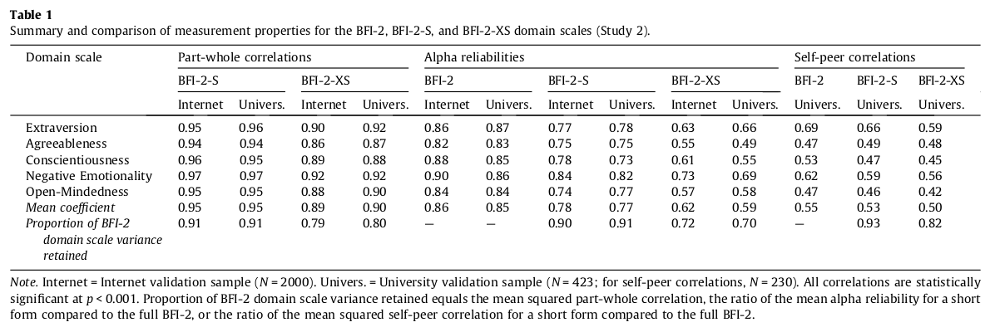

class:center, middle, bg_karl

```{r setup, include=FALSE}
options(htmltools.dir.version = FALSE)
knitr::opts_chunk$set(
  fig.width=9, fig.height=3.5, fig.retina=3,
  out.width = "100%",
  cache = FALSE,
  echo = FALSE,
  message = FALSE, 
  warning = FALSE,
  hiline = TRUE
)
```


```{r xaringan-themer, include=FALSE, warning=FALSE}
library(knitr)
library(xaringanthemer)
style_duo_accent(
  primary_color = "#b01333",
  secondary_color = "#085e9f",
  inverse_header_color = "#FFFFFF"
)
```
```{css, echo=F}
h1, h2, h3 {
  text-align: center;
}
```


```{css, echo = F}
.reduced_opacity {
  opacity: 0.1;
}
.bg_karl {
  position: relative;
  z-index: 1;
}
.bg_karl::before {    
      content: "";
      background-image: url('https://revistaespejo.com/wp-content/uploads/2023/01/intervencion-brasil.webp');
      background-size: cover;
      position: absolute;
      top: 0px;
      right: 0px;
      bottom: 0px;
      left: 0px;
      opacity: 0.35;
      z-index: -1;
}
```

## Uso de BFI-2-S y XS scale en el estudio de los sistemas de liderazgo político


<br>
<br>
<br>
<br>
<br>
<br>

#### Francisco Villarroel-Riquelme (CICS- UDD) 


<br>
<br>
<br>
<br>

```{r, echo=FALSE, message = FALSE, out.width="20%", fig.align='center'}
knitr::include_graphics("logo2017a.png")
```

---
background-image: url(pitch_files/logo2017a.png)
background-size: 170px

### Liderazgo y personalidad


.pull-left[

```{r, echo=FALSE, message=FALSE, warning=FALSE, out.width="70%",fig.align='center'}


```

]

--


.pull-right[

### Situación:

- Existe suficiente evidencia que muestra que para entender la relación líder-seguidor, **la personalidad importa**

- Uno de los test de personalidad más utilizado es el "Big five" (BFI)

- En los últimos años se han realizado mejoras y subescalas al Big Five y se crea el Big Five Inventory 2 (BFI-2)

- **Problema: ¡Tiene 60 ítemes!**

]
---
background-image: url(pitch_files/logo2017a.png)
background-size: 170px


**...¿Cómo medir la personalidad usando menos tiempo y de manera confiable?**

--

De esta forma `r emo::ji("backhand")`

```{r, echo=FALSE, warning=FALSE, message=FALSE, out.width="85%", fig.align='center'}

```


---
background-image: url(pitch_files/logo2017a.png)
background-size: 170px

### ¿Qué es el BFI-2?

.pull-left[

- **Es una medición jerarquica de los dominios de personalidad** del Big five + 15 "facetas" con rasgos específicos

- Contiene 60 ítemes. 6 ítemes por dominio y 3 por faceta

- Sus respuestas son una escala likert de 5 puntos desde "Muy en desacuerdo a "Muy de acuerdo". 

- Se realizó para dar una estructura jerarquica robusta, balancear el ancho de banda y fidelidad tanto del dominio como de las facetas, y minimizar la aquiescencia

]


--

.pull-right[

- Crítica al BFI original por el trade-off entre "ancho de banda" del rasgo y poca especificidad

- Facetas ayudan a especificar de mejor manera qué subdimensión específica de las 5 principales se está analizando

- Los modelos jerarquicos permiten obtener información más específica de la personalidad


]


puedes ver las distintas versiones e idiomas [en el siguiente link](https://www.colby.edu/psych/personality-lab/)


<br>

<font size="-3">Soto, Ch & John, O (2017). The next Big Five Inventory (BFI-2). Developing and Assesing a Hierarchical Model with 15 facets to Enhance Bandwidth, fidelity, and Predictive Power. Journal of Personality and Social Psychology. 113(1)</font>

---

```{r, fig.align='center'}


```


---
background-image: url(pitch_files/logo2017a.png)
background-size: 170px

## Forma de construcción

- Primero se arma la escala BFI-2-XS (15 ítemes. 1 por faceta, 3 por dominio) en base al BFI-2 original

--

- Utilizando una bbdd de validación del BFI-2, se eleccionan ítemes que:

  - 1) Correlacionen cada ítem de faceta con la escala total

--

  - 2) Que la carga factorial (vía CFA).

--

  - 3) Item Response Theory sobre la información que pŕovee sobre el rasgo de personalidad. 

--

  - 4) "Juicios conceptuales" respecto de los contenidos que representa cada item en el significado total de la escala.
  
--

  - 5) Confiabilidad a partir del re-testeo en la muestra de college
  
--

  - 6) Los patrones de carga de cada ítem en el AFE y el ACP del BFI-2-S que se extrajo

--

  - 7) Asegurarse que el BFI-2-S incluya un ítem verdadero y otro falso para cada faceta.
  

<br>

<font size="-3">Soto, Ch & John, O (2017). Short and extra-short form of the Big Five Inventory-2: The BFI-2-S and BFI-2-XS. Journal of Personality and Social Psychology. 68.</font>
  
---

### Selección de ítemes y Construcción de BFI-2-S

Todos estos criterios se usaron para armar una escala de 15 ítemes que diera cuenta de todos los dominios del BFI-2, que sean confiables, que tengan una estructura del bigfive y que minimice la aquiescencia.

- 7 de los 15 criterios resultaron en una sola sugerencia, mientras que 6 sugirieron 2 alternativas, y dos facetas fueron sugeridos tres ítemes. Para elegir se analizaron fortalezas y debilidades por cada ítem.


<br> 

#### BFI-2-XS

- Se seleccionaron bajo criterios similares, con la condición de correlacionen entre cada ítem (consistencia), pero no mucho (para evitar redundancia)
- 10 de 15 ítemes cumplieron esos criterios. Los otros 5 se eligieron a partir de la calidad del ítem. 


---

### BFI-2-XS Y S


```{r, out.width="65%", fig.align='center'}
knitr::include_graphics("beamer_files/BFI-2-S-XS_spanish.png")
```


---
background-image: url(pitch_files/logo2017a.png)
background-size: 170px

## Propiedades psicométricas

```{r, echo=FALSE, message=FALSE, warning=FALSE, out.width="90%", fig.align='center'}



```

--

- BFI-2-S: m=0.95 (.94 - .97) | $\alpha$: m= .85 (.82 - .90)
- BFI-2-XS: m=.89 (.86 - .92) | $\alpha$: m= .77 (.59 - .62) -> Leve decaimiento

---


---
background-image: url(pitch_files/logo2017a.png)
background-size: 170px

### Pro's y contras (¿cuándo se usa cada cuestionario?)


- Ahorro de tiempo que permite integrarlo a investigaciones de de otra forma no podrían medir personalidad

--

- **Una mejora en el tiempo implica una baja en su confiabilidad**. Aproximadamente 10% menos preciso en el BFI-2-S y un 20% en el BFI-2-XS. **Esto implica que correlaciones entre personalidad y otros atributos sean menos que con formularios largos"**.

--

- Formularios cortos cuesta testear efectos más complejos.

--

- Si se busca testear rasgos de personalidad a nivel jerarquico, se sugiere el BFI-2-S. Si sólo se busca a nivel de big five "clásico", el BFI-2-XS está bien.


---
class: inversed, center, middle
background-image: url(https://user-images.githubusercontent.com/163582/45438104-ea200600-b67b-11e8-80fa-d9f2a99a03b0.png)
background-size: 70px
background-position: 50% 90%

# ¡Gracias!


###fvillarroelr@udd.cl

  <font size="-1">Este slide fue creado con el paquete</font> <a href="https://github.com/yihui/xaringan">**xaringan**</a>

---
class: inversed, center, middle


## Apéndices


---

### Escala en español BFI-2-S Y BFI-2-XS

```{r, echo=FALSE, message=FALSE, warning=FALSE, out.width="80%", fig.align='center'}

knitr::include_graphics("beamer_files/cuestionario_español.png")

```


---
## Estudio 1: Liderazgo compensatorio y castigador en juegos de coordinación 

**Analizar cómo los mecanismos de retroalimentación afectan el comportamiento de los seguidores**


.pull-left[


#### Nos enfocaremos en 

- **Performance grupal**: Cómo es el desempeño general del grupo para obtener recursos

- **Emociones**: Tipo y nivel de emociones de los seguidores hacia el líder (ira, miedo, felicidad y tristeza)

- **Tendencia al abandono de líder**: Cuándo los seguidores abandonan a su líder

]

--

.pull-right[ 

#### Métodos

- _lab-in-the-field_ experiment (N=300)

- Exposición de consentimiento informado 
- Juego de bienes comunes con umbral
- Preguntas de caracterización sociodemográfica
- Preguntas sobre consumo de información política, interés y autoidentificación política
- Escala de timidez


]

---
class: left, middle

```{r, echo=FALSE, out.width="100%", fig.align='center'}
knitr::include_graphics("proyecto_denise_03.png")
```

---
class: left, middle

### Características de las condiciones experimentales

```{r, echo=FALSE, out.width="100%", fig.align='center'}

```

---
class: left, middle


```{r, echo=FALSE, out.width="100%", fig.align='center'}

```

